# Physics-Aware Lightweight Segmentation for Quantitative Holographic Cell Analysis with Optical Mass Preservation

**Usama Ikram**¹, **Youhyun Kim**², and **Inkyu Moon**¹²\*
¹ Department of Artificial Intelligence, DGIST, Daegu, South Korea
² Department of Robotics & Mechatronics Engineering, DGIST, Daegu, South Korea

Official PyTorch implementation of a **physics-aware, LoRA-adapted lightweight segmentation framework** for red blood cell (RBC) quantitative phase images (QPI) acquired with digital holographic microscopy (DHM).

<p align="center">
  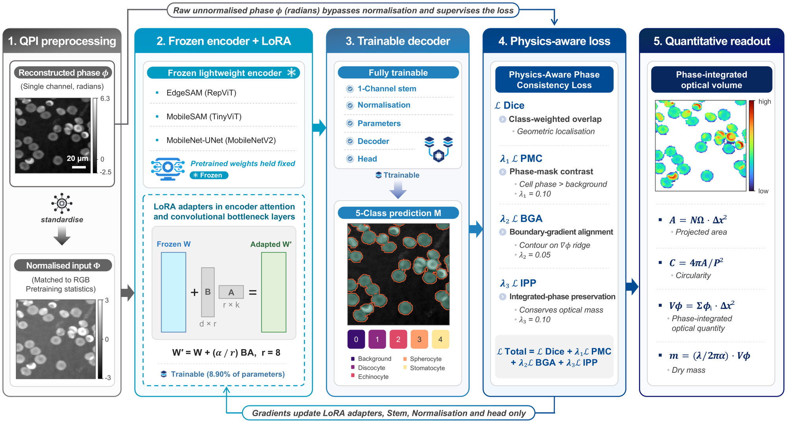
</p>

<p align="center"><em><b>Fig. 1.</b> Framework overview. LoRA-adapted lightweight networks segment cells from quantitative phase images. The raw, unnormalised phase goes straight into the Physics-Aware Phase Consistency Loss (PMC + BGA + IPP), so the predicted masks work as physically meaningful measurement domains for integrated phase and dry mass.</em></p>

---

## Contents

- [Overview](#overview)
- [Key results](#key-results)
- [Method](#method)
- [Repository structure](#repository-structure)
- [Installation](#installation)
- [Data](#data)
- [Pretrained backbone weights](#pretrained-backbone-weights)
- [Usage](#usage)
- [Results and figures](#results-and-figures)
- [Reproducing the manuscript figures and tables](#reproducing-the-manuscript-figures-and-tables)
- [Citation](#citation)

---

## Overview

In QPI, a segmentation mask is more than a geometric contour. It defines the **measurement domain** over which the phase signal is integrated to estimate biophysical quantities such as cellular **dry mass**. Losses like Dice or Cross-Entropy only reward geometric overlap, so a mask can score well and still gain or lose phase at its boundary, which then biases every measurement made from it.

This repository provides:

- **Physics-Aware Phase Consistency Loss.** Class-weighted multi-class Dice combined with three phase-derived constraints: **Phase-Mask Contrast (PMC)**, **Boundary-Gradient Alignment (BGA)** and **Integrated-Phase Preservation (IPP)**.
- **LoRA adaptation of three lightweight segmenters.** MobileNet-UNet (CNN), MobileSAM (TinyViT) and EdgeSAM (RepViT), adapted from RGB pre-training to single-channel phase maps with only a small fraction of trainable parameters.
- **Complete experimental pipeline.** LoRA rank sweep, LoRA vs. full fine-tuning, component-wise loss ablation, GPU benchmarking (PyTorch / ONNX Runtime, FP32 / FP16) and per-cell morphology and dry-mass analysis over 47 days of blood storage.

## Key results

| | EdgeSAM + LoRA (r = 8), full physics-aware loss |
|---|---|
| Boundary F1 | **0.952** |
| Mean Dice (4 RBC classes) | 0.727 |
| Trainable parameters | **0.53 M** (8.9 %) |
| Throughput (ONNX FP16, RTX A5000) | **228.3 FPS** (p50 latency 4.33 ms, 16.4 MB peak VRAM) |
| Global integrated-phase error (IPE), Dice-only → full loss | 5.22 % → **3.04 %** (MobileNet-UNet: 15.52 % → 3.01 %) |
| Dry-mass agreement, predicted vs. annotated masks | Pearson **r = 0.966**, median bias 1.5 % (1,974 cells, 66 images) |

## Method

**Input.** Single-channel reconstructed phase maps (float32, radians). A normalised copy is fed to the network for numerical stability. The **raw phase** is kept separately and used only by the physics-aware loss, so normalisation never changes the physical signal. Augmentations are geometric only (flips, 90° rotations, translation). No intensity or phase-value changes are applied.

**LoRA.** For a frozen weight `W`, the adapted weight is `W' = W + (B·A)·α/r`. Adapters are inserted into the query/value projections of transformer encoders and into bottleneck convolutions of CNN encoders (`models/lora_utils.py`). The single-channel input stem, normalisation layers, decoder and output head stay trainable.

**Loss** (`training/losses.py`):

```
L_total = L_Dice + λ1·L_PMC + λ2·L_BGA + λ3·L_IPP        (λ1 = 0.1, λ2 = 0.05, λ3 = 0.1)
```

| Term | What it does |
|---|---|
| `L_Dice` | Class-weighted, smoothed multi-class Dice, `w = [0.5, 1.0, 1.5, 2.0, 2.0]` (background, discocyte, echinocyte, spherocyte, stomatocyte) |
| `L_PMC` | `max(0, μ_bg − μ_cell + margin)`: the predicted foreground must have higher phase than the background |
| `L_BGA` | L1 distance between the max-normalised gradient of the predicted mask and of the raw phase, which anchors contours to phase transitions |
| `L_IPP` | `|S_pred − S_GT| / (|S_GT| + ε)` with `S = Σ M_i φ_i`, which preserves the integrated phase inside the predicted region |

The physics terms act on the binary foreground probability, so the physical constraint on the measurement domain stays separate from morphology classification.

**Quantitative readout.** For each connected component the pipeline computes: projected area `A = N_Ω Δx²` (Δx = 0.1441 µm/px), circularity `C = 4πA/P²` (Crofton perimeter), integrated phase `S_φ = Σ φ_i Δx²`, and dry mass `m = λ/(2πα) · S_φ` (λ = 666 nm, α = 0.2 mL/g).

## Repository structure

```text
.
├── main.py                    # Entry point: --mode train | evaluate | sweep
├── collect_metrics.py         # Aggregates all runs into results/*_metrics.csv / *_morphology.csv
├── yaml_gen.py                # Generates the 12 loss-ablation configs in configs/ablation/
├── extract_visual.py          # Runs the r=8 models on the val set; exports arrays for Figs. 7, 9, 11
├── calibrated_dry_mass.py     # Per-cell area / circularity / dry mass (Table 8, Fig. 12)
├── dry_mass.py                # Alternative per-cell dry-mass export from float phase maps
├── requirements.txt
│
├── configs/
│   ├── edge_sam_lora.yaml     # Main LoRA configs (used for the rank sweep)
│   ├── mobile_sam_lora.yaml
│   ├── mobilenet_unet_lora.yaml
│   ├── full_finetune/         # Full fine-tuning baselines (no LoRA)
│   └── ablation/<arch>/       # dice_only | pmc | pmc_bga | full  (loss ablation, r=8)
│
├── datasets/                  # QPI dataset, class-balanced sampler, geometric-only augmentation
├── models/                    # EdgeSAM, MobileSAM, MobileNet-UNet wrappers + LoRA injection
├── training/                  # Trainer (AdamW, cosine LR, FP16) and physics-aware losses
├── evaluation/                # Dice / IoU / AJI / Boundary-F1 / IPE metrics, evaluator, metric tracker
├── analysis/                  # Morphology extraction and plotting of trends and qualitative figures
├── benchmark/benchmark.py     # Latency / FPS / VRAM benchmark (PyTorch and ONNX Runtime)
├── visualization/             # Regenerates the data-driven manuscript figures from JSON
├── utils/                     # YAML config loader, seeding
│
├── results/                   # Metrics and per-cell measurements behind every table (see below)
├── docs/figures/              # Manuscript figures shown in this README
└── weights/                   # Place pretrained EdgeSAM / MobileSAM checkpoints here (not tracked)
```

<details>
<summary><b>Contents of <code>results/</code></b></summary>

| Path | Content | Used for |
|---|---|---|
| `<arch>_lora_r{2,4,8,16,32}/<ARCH>_R<r>/metrics.json` | Per-run training history and best validation metrics | Tables 1–2, Figs. 2–4 |
| `<arch>_lora_r*/default_run/morphology_trends_rank_*.csv` | Per-image morphology from the evaluator | Morphology analysis |
| `full_finetune/<arch>/…` | Full fine-tuning runs | Table 3, Fig. 6 |
| `ablation/<arch>/<loss>/…` | Loss-ablation runs (r = 8) | Tables 4–5, Fig. 8 |
| `lora_sweep_*.csv/json`, `full_finetune_*.csv/json`, `ablation_*.csv/json` | Aggregated tables written by `collect_metrics.py` | All tables |
| `compiled_training_metrics.csv`, `compiled_morphology_trends.csv` | Aggregated sweep metrics and morphology | Figure scripts |
| `benchmarks/hardware_benchmark_cuda.csv` (+ terminal log) | Latency, FPS and VRAM for every model / rank / precision / runtime | Tables 2, 7, Fig. 5 |
| `dry_mass_pred.csv`, `dry_mass_calibrated.csv` | Per-cell measurements from EdgeSAM-predicted and annotation masks | Table 8, Fig. 12 |
| `dry_mass_cells.csv`, `dry_mass_by_day.csv` | Output of the alternative `dry_mass.py` export | Not used in the manuscript |
| `analysis/*.npy` | Sample phase map, ground truth and r = 8 predictions | Figs. 7, 9 |

Model checkpoints (`checkpoints/best_model.pt`) are not included in the repository.
</details>

## Installation

Tested with Python 3.10, PyTorch 2.0.1 (CUDA 11.7) and ONNX Runtime 1.16.3 on an NVIDIA RTX A5000.

```bash
git clone https://github.com/uikram/Physics-Aware-Lightweight-Segmentation-for-Quantitative-Holographic-Cell-Analysis-with-Optical-Mass-.git
cd Physics-Aware-Lightweight-Segmentation-for-Quantitative-Holographic-Cell-Analysis-with-Optical-Mass-

conda create -n qpi-seg python=3.10 -y
conda activate qpi-seg

# 1. PyTorch (choose the build that matches your CUDA version: https://pytorch.org)
pip install torch torchvision

# 2. Project dependencies
pip install -r requirements.txt

# 3. Backbone packages
pip install git+https://github.com/ChaoningZhang/MobileSAM.git        # provides `mobile_sam`
git clone https://github.com/chongzhou/EdgeSAM.git && pip install -e EdgeSAM   # provides `edge_sam`
```

## Data

The RBC QPI dataset (DHM, 47-day blood-storage study) is **not included** in this repository. Please contact the corresponding author about data access.

- 1,090 densely annotated phase images from 11 storage time points (days 0, 5, 8, 12, 15, 19, 23, 27, 30, 37, 47)
- Split: 1,024 training / 66 validation images (6 validation patches per time point)
- 5-class semantic masks: `0` background, `1` discocyte, `2` echinocyte, `3` spherocyte, `4` stomatocyte

Expected layout (the path is set by `data_root` in each config, default `./dataset`):

```text
dataset/
├── X_train/   # single-channel phase maps (.tif / .npy), e.g. 20110511_1.tif
├── Y_train/   # integer masks with the same stem (values 0–4)
├── X_val/     # validation phase maps (also used for evaluation)
└── Y_val/
```

File stems begin with the acquisition date (`YYYYMMDD_*`). The storage day is computed relative to the earliest date, which is needed for the longitudinal analysis.

## Pretrained backbone weights

Download the official checkpoints into `weights/` (see [`weights/README.md`](weights/README.md)):

```bash
mkdir -p weights
wget -P weights https://huggingface.co/spaces/chongzhou/EdgeSAM/resolve/main/weights/edge_sam_3x.pth
wget -P weights https://github.com/ChaoningZhang/MobileSAM/raw/master/weights/mobile_sam.pt
```

MobileNet-UNet uses torchvision's ImageNet `MobileNet_V2_Weights.IMAGENET1K_V1`, which is downloaded automatically.

## Usage

Run all commands from the repository root. Outputs are written under `results/`.

### 1. Train a single model

```bash
python main.py --mode train --config configs/edge_sam_lora.yaml --gpu 0
```

### 2. LoRA rank sweep (Table 2, Fig. 4)

Trains and evaluates one model per rank and writes `results/<arch>_lora_r<r>/`:

```bash
python main.py --mode sweep --config configs/edge_sam_lora.yaml      --ranks 2 4 8 16 32
python main.py --mode sweep --config configs/mobile_sam_lora.yaml    --ranks 2 4 8 16 32
python main.py --mode sweep --config configs/mobilenet_unet_lora.yaml --ranks 2 4 8 16 32
```

### 3. Full fine-tuning baselines (Table 3, Fig. 6)

```bash
for arch in edge_sam mobile_sam mobilenet_unet; do
  python main.py --mode train    --config configs/full_finetune/$arch.yaml
  python main.py --mode evaluate --config configs/full_finetune/$arch.yaml
done
```

### 4. Physics-aware loss ablation (Tables 4–5, Fig. 8)

The configs are already in `configs/ablation/`. Regenerate them with `python yaml_gen.py` if needed.

```bash
for arch in edge_sam mobile_sam mobilenet_unet; do
  for loss in dice_only pmc pmc_bga full; do
    python main.py --mode train    --config configs/ablation/$arch/$loss.yaml
    python main.py --mode evaluate --config configs/ablation/$arch/$loss.yaml
  done
done
```

### 5. Aggregate metrics

```bash
python collect_metrics.py --results_dir results
```

### 6. Computational benchmark (Table 7, Fig. 5)

50 warm-up iterations and 500 timed forward passes per configuration. `--onnx` adds ONNX Runtime (CUDA EP) runs. MobileSAM is reported under PyTorch only.

```bash
python benchmark/benchmark.py --ranks 0 2 4 8 16 32 --precisions fp32 fp16 --onnx
```

### 7. Per-cell morphology and dry mass (Table 8, Fig. 12)

```bash
# annotation masks  -> results/dry_mass_calibrated.csv
python calibrated_dry_mass.py --tif-dir dataset/X_val --mask-dir dataset/Y_val
# EdgeSAM r=8 masks -> results/dry_mass_pred.csv
python calibrated_dry_mass.py --use-model --out results/dry_mass_pred.csv
```

The calibration constants and procedure are documented in the script header.

### 8. Figures

```bash
python visualization/visualization.py            # Figs. 2–6, 8, 10, 12 from visualization/data/*.json
python extract_visual.py                          # exports arrays + storage-timeline grid (needs checkpoints)
python analysis/plot_trends.py --results_dir results   # boundary alignment, qualitative grid, training/morphology plots
```

## Results and figures

All models were trained with the same schedule (AdamW, cosine LR, FP16, 50 epochs) and evaluated on the same 66-image validation split. Dice and IoU are macro-averaged over the four RBC classes, and a missed class counts as 0.

### Architecture comparison at LoRA r = 8

| Architecture | Mean Dice ↑ | AJI ↑ | Boundary F1 ↑ | Dice<sub>echi</sub> ↑ | Dice<sub>stom</sub> ↑ | Trainable params ↓ |
|---|---|---|---|---|---|---|
| MobileNet-UNet | 0.417 | 0.634 | 0.971 | 0.000 | 0.000 | 5.58 M |
| MobileSAM | **0.812** | 0.249 | 0.644 | 0.852 | 0.710 | 0.67 M |
| **EdgeSAM** | 0.727 | 0.484 | 0.952 | 0.776 | 0.536 | **0.53 M** |

<p align="center">
  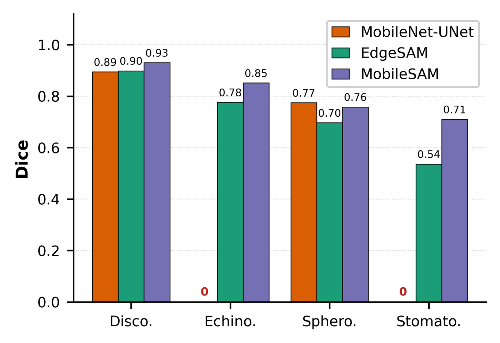
  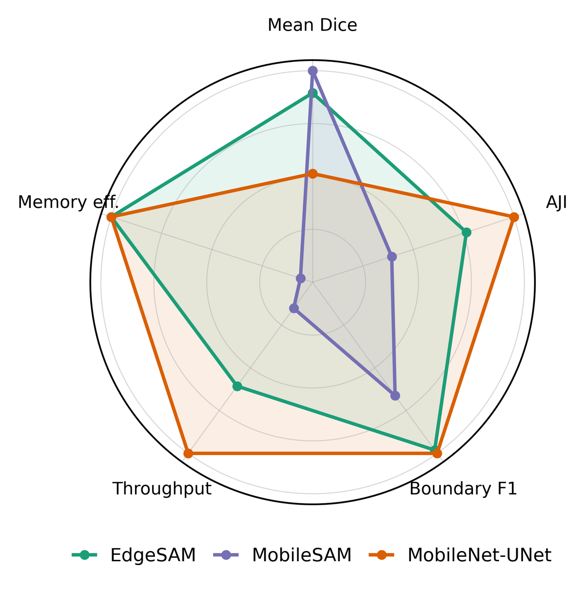
</p>
<p align="center"><em><b>Fig. 2</b> (left): per-class Dice at r = 8. MobileNet-UNet misses echinocytes and stomatocytes entirely (zero bars). <b>Fig. 3</b> (right): aggregate performance, each axis normalised to the best model. EdgeSAM is the only model that detects all four morphologies while also giving high boundary fidelity and reasonable instance separation.</em></p>

### LoRA rank sweep (EdgeSAM)

| Rank | Trainable | Mean Dice ↑ | Mean IoU ↑ | AJI ↑ | Boundary F1 ↑ | IPE (%) ↓ | p50 (ms) / VRAM (MB) |
|---|---|---|---|---|---|---|---|
| 2 | 0.30 M (5.20 %) | 0.633 | 0.482 | 0.465 | 0.905 | 8.62 | 15.54 / 177.3 |
| 4 | 0.38 M (6.46 %) | 0.638 | 0.490 | 0.405 | 0.918 | 5.53 | 15.33 / 177.9 |
| **8** | **0.53 M (8.90 %)** | **0.727** | **0.588** | **0.484** | **0.952** | 3.63 | 13.36 / 177.9 |
| 16 | 0.85 M (13.40 %) | 0.676 | 0.533 | 0.420 | 0.946 | 3.86 | 13.32 / 177.9 |
| 32 | 1.47 M (21.19 %) | 0.710 | 0.567 | 0.372 | 0.950 | 3.45 | 13.25 / 177.9 |

<p align="center">
  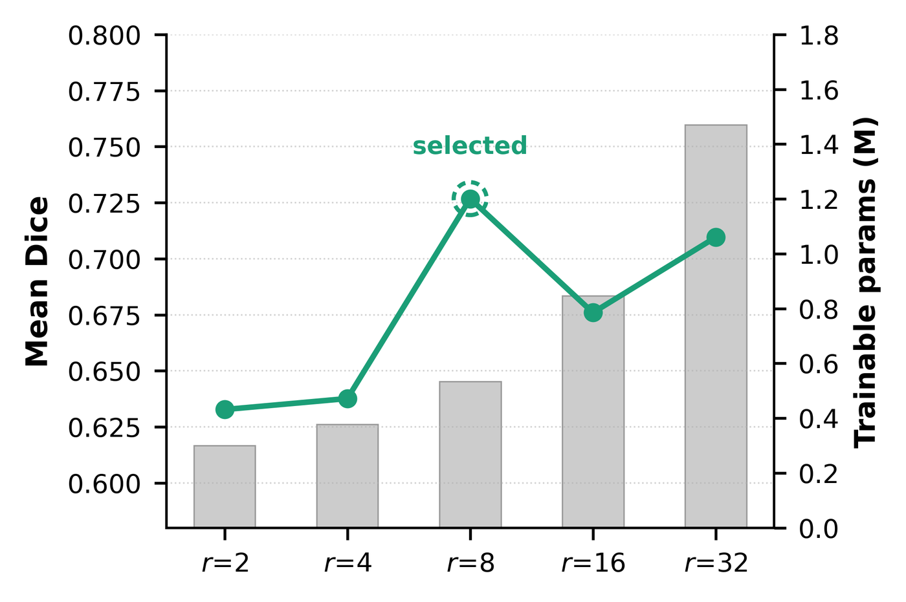
  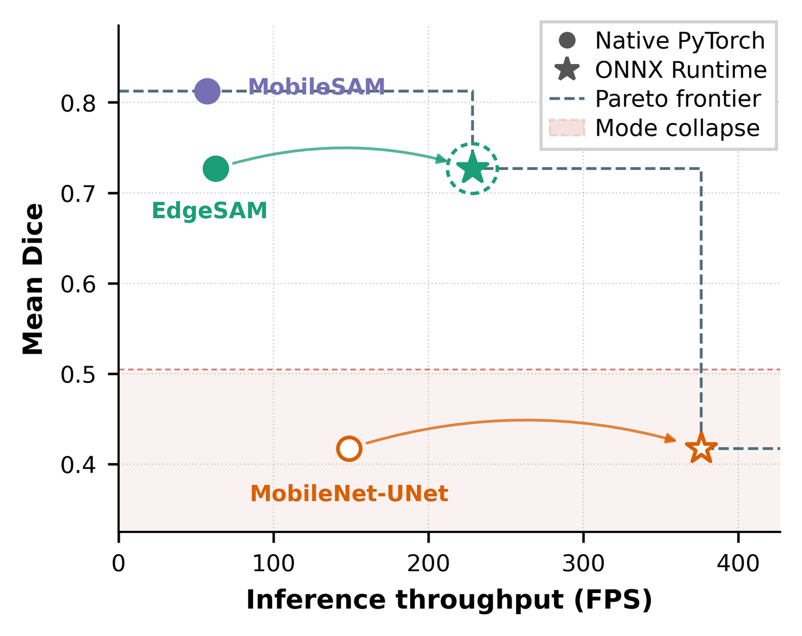
</p>
<p align="center"><em><b>Fig. 4</b> (left): mean Dice (line) and trainable parameters (bars) against LoRA rank. Ranks above 8 add parameters without improving accuracy. <b>Fig. 5</b> (right): accuracy–throughput frontier at r = 8, FP16. Arrows join the PyTorch and ONNX Runtime points of each architecture, and the dashed ring marks the selected EdgeSAM configuration.</em></p>

### LoRA vs. full fine-tuning

| Architecture | Method | Trainable | Mean Dice ↑ | BF1 ↑ | AJI ↑ | IPE (%) ↓ | Dice<sub>echi</sub> | Dice<sub>stom</sub> |
|---|---|---|---|---|---|---|---|---|
| EdgeSAM | **LoRA (r = 8)** | 0.53 M (8.9 %) | **0.727** | **0.952** | **0.484** | **3.63** | **0.776** | 0.536 |
| | Full FT | 5.69 M (100 %) | 0.557 | 0.931 | 0.431 | 5.08 | 0.000 | **0.625** |
| MobileSAM | **LoRA (r = 8)** | 0.67 M (10.0 %) | **0.812** | 0.644 | 0.249 | **2.57** | **0.852** | **0.710** |
| | Full FT | 6.66 M (100 %) | 0.419 | **0.665** | **0.280** | 2.76 | 0.000 | 0.000 |
| MobileNet-UNet | LoRA (r = 8) | 5.58 M (71.8 %) | 0.417 | **0.971** | 0.634 | **2.60** | 0.000 | 0.000 |
| | Full FT | 7.62 M (100 %) | **0.420** | 0.969 | **0.705** | 3.56 | 0.000 | 0.000 |

<p align="center">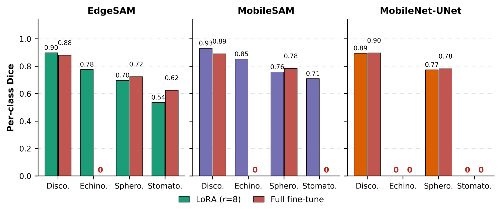</p>
<p align="center"><em><b>Fig. 6.</b> Per-class Dice for LoRA (r = 8) and full fine-tuning. Full fine-tuning wipes out minority classes (for example EdgeSAM echinocytes), whereas LoRA keeps them.</em></p>

### Physics-aware loss ablation (r = 8)

| Architecture | Loss | Dice ↑ | IoU ↑ | BF1 ↑ | AJI ↑ | IPE (%) ↓ |
|---|---|---|---|---|---|---|
| EdgeSAM | L<sub>Dice</sub> only | 0.757 | 0.621 | 0.938 | **0.525** | 5.22 |
| | + L<sub>PMC</sub> | 0.608 | 0.511 | 0.386 | 0.339 | 47.20 |
| | + L<sub>PMC</sub> + L<sub>BGA</sub> | **0.763** | **0.627** | 0.929 | 0.421 | 6.13 |
| | **Full (+ L<sub>IPP</sub>)** | 0.740 | 0.601 | **0.953** | 0.377 | **3.04** |
| MobileNet-UNet | L<sub>Dice</sub> only | **0.425** | **0.374** | 0.913 | 0.633 | 15.52 |
| | **Full (+ L<sub>IPP</sub>)** | 0.419 | 0.363 | **0.970** | **0.675** | **3.01** |
| MobileSAM | L<sub>Dice</sub> only | **0.813** | **0.695** | **0.665** | 0.235 | 2.46 |
| | + L<sub>PMC</sub> + L<sub>BGA</sub> | 0.804 | 0.683 | 0.664 | **0.251** | **2.37** |

*The full table, including every configuration and per-class IPE, is in `results/ablation_metrics.csv` and in the manuscript (Tables 4–5).*

<p align="center">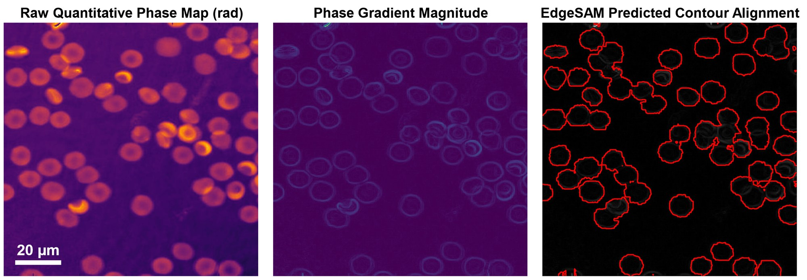</p>
<p align="center"><em><b>Fig. 7.</b> Left to right: quantitative phase map, phase-gradient magnitude, and EdgeSAM (r = 8) contours overlaid on the gradient map. The predicted boundaries follow the phase transitions that the BGA term targets.</em></p>

<p align="center">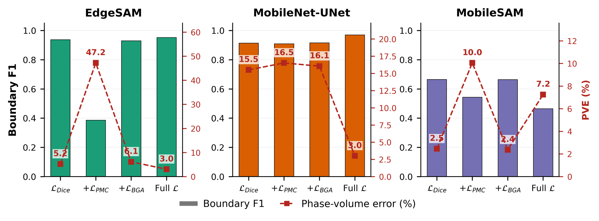</p>
<p align="center"><em><b>Fig. 8.</b> Component-wise loss ablation. Bars show Boundary F1 (left axis) and the dashed line shows global integrated-phase error (right axis). Adding IPP gives the lowest IPE for EdgeSAM and MobileNet-UNet. For MobileSAM the effect depends on the architecture.</em></p>

### Integrated-phase preservation (r = 8)

| Architecture | Global IPE (%) ↓ | Disco. | Echi. | Sphero. | Stom. | AJI ↑ |
|---|---|---|---|---|---|---|
| MobileNet-UNet | 2.60 | 61.2 | 100.0 | 27.6 | 100.0 | 0.634 |
| MobileSAM | **2.57** | 6.8 | 33.0 | 33.7 | 47.9 | 0.249 |
| EdgeSAM | 3.63 | 7.3 | 35.2 | 27.2 | 64.1 | 0.484 |

A low global IPE alone is not enough. MobileNet-UNet misses two classes (100 % class IPE), and MobileSAM merges neighbouring cells (low AJI). EdgeSAM gives the most usable per-cell measurement domains.

### Computational efficiency (NVIDIA RTX A5000, r = 8)

| Model | Runtime | Precision | p50 (ms) ↓ | p99 (ms) ↓ | FPS ↑ | Peak VRAM (MB) ↓ |
|---|---|---|---|---|---|---|
| EdgeSAM | PyTorch | FP32 | 13.36 | 13.89 | 74.82 | 177.9 |
| | ONNX | FP32 | 3.99 | 4.21 | 248.87 | 24.6 |
| | PyTorch | FP16 | 15.87 | 16.96 | 62.64 | 157.4 |
| | **ONNX** | **FP16** | **4.33** | **4.70** | **228.33** | **16.4** |
| MobileNet-UNet | PyTorch | FP32 | 7.42 | 9.07 | 132.69 | 186.0 |
| | ONNX | FP32 | 2.75 | 4.12 | 359.61 | 24.6 |
| | PyTorch | FP16 | 6.62 | 8.22 | 148.87 | 161.2 |
| | ONNX | FP16 | 2.62 | 4.15 | 376.10 | 16.4 |
| MobileSAM | PyTorch | FP32 | 19.07 | 19.30 | 52.33 | 528.3 |
| | PyTorch | FP16 | 17.33 | 19.55 | 57.18 | 270.7 |

MobileSAM is reported under PyTorch only because parts of its mask decoder are not supported by the ONNX Runtime CUDA Execution Provider. These numbers describe desktop-GPU efficiency, not deployment on an embedded device.

### Qualitative segmentation

<p align="center">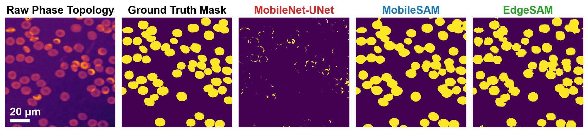</p>
<p align="center"><em><b>Fig. 9.</b> Raw phase, ground truth and r = 8 predictions. MobileNet-UNet returns almost empty masks for minority-class cells, MobileSAM merges neighbouring cells, and EdgeSAM gives individual cell contours.</em></p>

### Biological analysis: 47-day RBC storage

<p align="center">
  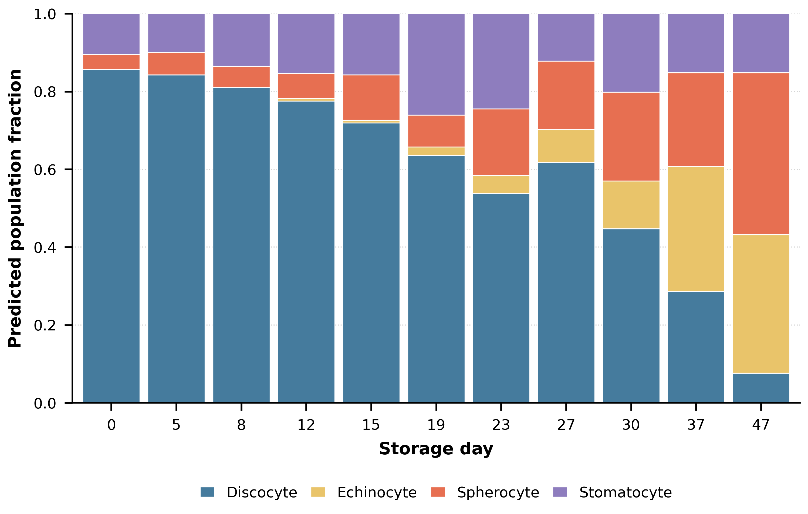
</p>
<p align="center"><em><b>Fig. 10.</b> Predicted RBC morphology composition over storage (EdgeSAM, r = 8). Discocytes dominate early on, and echinocytes and spherocytes take over by day 47.</em></p>

<p align="center">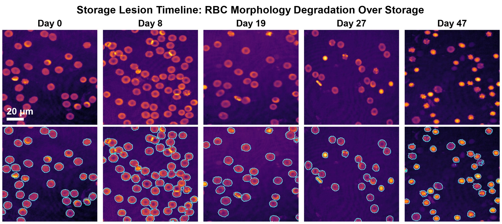</p>
<p align="center"><em><b>Fig. 11.</b> Representative phase images (top) and EdgeSAM contours (bottom) across the storage period.</em></p>

| Day | n | Area (µm²) | Circularity | Dry mass (pg) | Composition (%) |
|---|---|---|---|---|---|
| 0 | 181 | 63.1 ± 24.3 | 0.745 ± 0.123 | 31.8 ± 13.0 | Disco. 86, Stom. 10 |
| 15 | 146 | 83.6 ± 40.2 | 0.651 ± 0.155 | 35.9 ± 18.2 | Disco. 72, Stom. 16, Sphero. 12 |
| 30 | 228 | 61.9 ± 32.0 | 0.713 ± 0.146 | 30.5 ± 13.9 | Disco. 45, Sphero. 23, Stom. 20 |
| 37 | 178 | 51.3 ± 26.4 | 0.748 ± 0.118 | 26.5 ± 11.8 | Echi. 32, Disco. 29, Sphero. 24 |
| 47 | 250 | 43.4 ± 20.2 | 0.729 ± 0.136 | 26.6 ± 9.4 | Sphero. 42, Echi. 36, Stom. 15 |

*Selected days shown. All 11 time points (1,974 cells in total) are in `results/dry_mass_pred.csv` and in manuscript Table 8.*

<p align="center">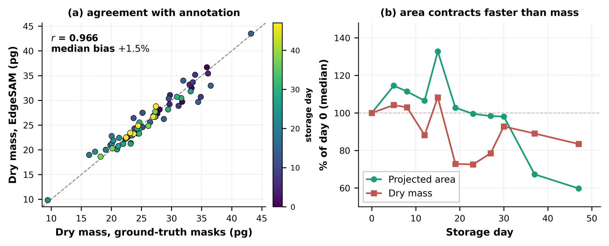</p>
<p align="center"><em><b>Fig. 12.</b> (a) Per-image median dry mass from EdgeSAM-predicted masks against annotation masks (r = 0.966, median bias +1.5 %). (b) Median projected area and dry mass relative to day 0. Projected area shrinks much more than dry mass during storage.</em></p>

## Reproducing the manuscript figures and tables

| Manuscript item | Source data | Script |
|---|---|---|
| Fig. 1 | — (diagram) | — |
| Figs. 2, 3, 4, 5, 6, 8, 10, 12 | `visualization/data/figureXX.json` (derived from `results/`) | `visualization/visualization.py` |
| Fig. 7 (boundary alignment), Fig. 9 (qualitative grid) | `results/analysis/*.npy` | `extract_visual.py` → `analysis/plot_trends.py` |
| Fig. 11 (storage timeline) | validation set + r = 8 checkpoint | `extract_visual.py` |
| Tables 1–6 | `results/lora_sweep_metrics.csv`, `full_finetune_metrics.csv`, `ablation_metrics.csv` | `collect_metrics.py` |
| Table 7 | `results/benchmarks/hardware_benchmark_cuda.csv` | `benchmark/benchmark.py` |
| Table 8 | `results/dry_mass_pred.csv` | `calibrated_dry_mass.py --use-model` |

## Citation

The manuscript is currently under review. If you use this code, please cite:

```bibtex
@article{ikram2026physicsaware,
  title   = {Physics-Aware Lightweight Segmentation for Quantitative Holographic Cell Analysis with Optical Mass Preservation},
  author  = {Ikram, Usama and Kim, Youhyun and Moon, Inkyu},
  year    = {2026},
  note    = {Manuscript under review}
}
```

## Acknowledgements

This work builds on [EdgeSAM](https://github.com/chongzhou/EdgeSAM), [MobileSAM](https://github.com/ChaoningZhang/MobileSAM) and torchvision's [MobileNetV2](https://pytorch.org/vision/stable/models/mobilenetv2.html). Please follow the licences of these projects when using their pretrained weights.

## Contact

Usama Ikram, Department of Artificial Intelligence, DGIST
